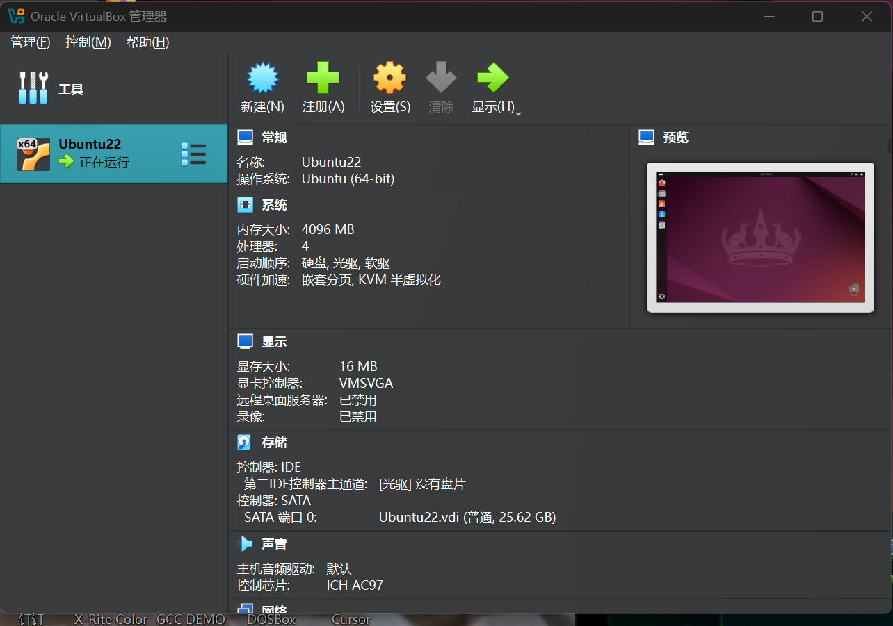

# ISEA Lab Activities - BRG-27

## Day 1 – Morning

### GitHub Repository Setup
- Created GitHub account and repository: `BRG-27-labs`
- Cloned repository to local machine
- Created README.md for documentation

### VirtualBox and Ubuntu Installation
- Installed VirtualBox on host machine
- Downloaded Ubuntu ISO from official website
- Created VM with 4GB RAM and 20GB disk
- Installed Ubuntu successfully

Installation Screenshot:  

### Basic Linux Navigation and Commands
- Practiced using:
  - `pwd`, `ls`, `cd`, `mkdir`, `touch`
- Explored important directories:
  - `/etc`, `/var`, `/home`
- Used `man` to read manual pages (e.g., `man ls`, `man grep`)

