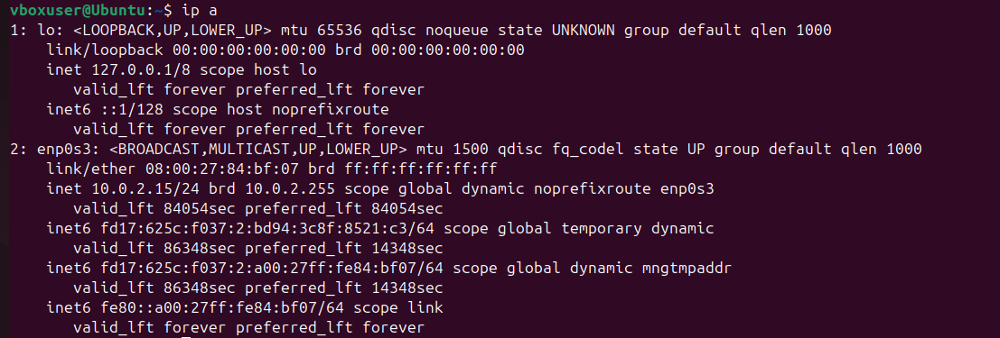
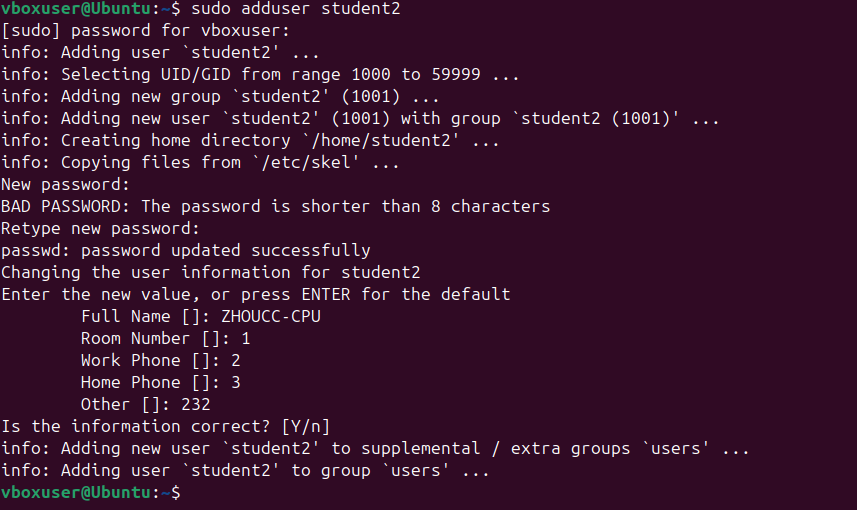
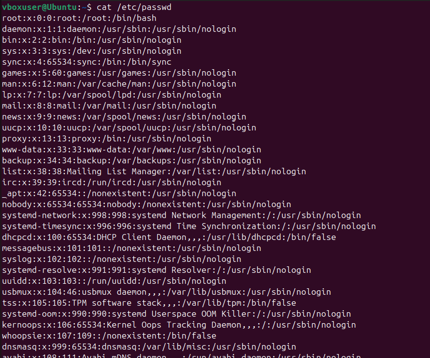
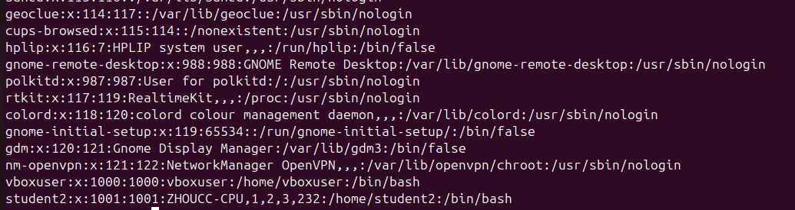

# ISEA Lab Activities - BRG-27

## Day 1 – Morning

### GitHub Repository Setup
- Created GitHub account and repository: `BRG-27-labs`
- Cloned repository to local machine
- Created README.md for documentation

### VirtualBox and Ubuntu Installation
- Installed VirtualBox on host machine
- Downloaded Ubuntu ISO from official website
- Created VM with 4GB RAM and 20GB disk
- Installed Ubuntu successfully

Installation Screenshot:  

### Basic Linux Navigation and Commands
- Practiced using:
  - `pwd`, `ls`, `cd`, `mkdir`, `touch`
- Explored important directories:
  - `/etc`, `/var`, `/home`
- Used `man` to read manual pages (e.g., `man ls`, `man grep`)

## Day 1 – Afternoon

### Linux Service Management
- Listed services with: `systemctl list-units --type=service`
- Started and stopped service: `cron`
- Verified service status using: `systemctl status cron`

Screenshot:  
  
  

### Linux File Permissions
- Viewed file permissions using: `ls -l`
- Modified permissions with: `chmod +x`
- Changed ownership with: `chown`

Screenshot:  

### Searching Filesystem
- Used `find` to locate files
- Used `grep -r` to search file contents

Screenshot:  

## Day 2 – Morning

### User and Group Management

- Created group `group1`
- Added users `student1`, `student2`
- Added both users to group1 using `usermod`
- Verified group memberships with `groups` and `/etc/group`
- Verified users exist via `/etc/passwd`

Screenshot:  
  
  
  

