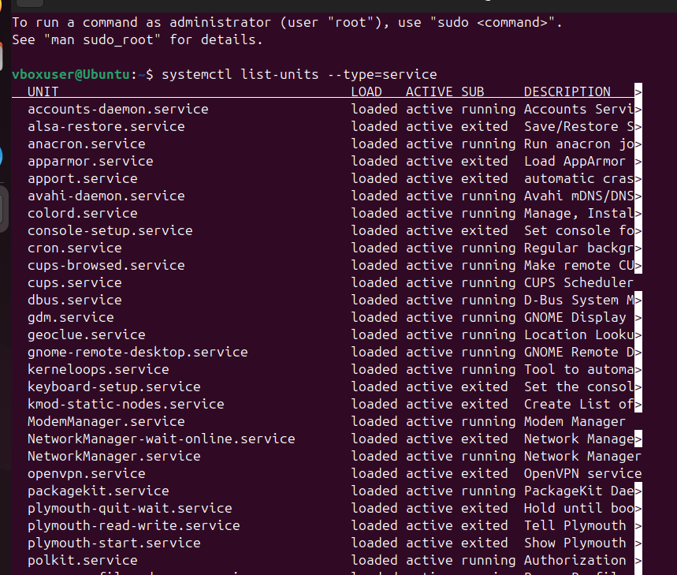
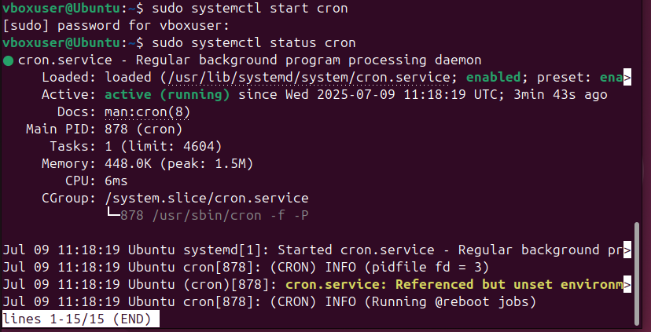
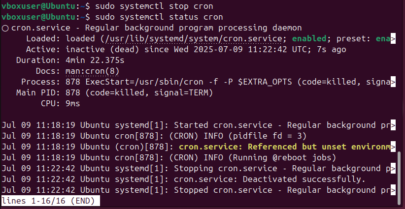
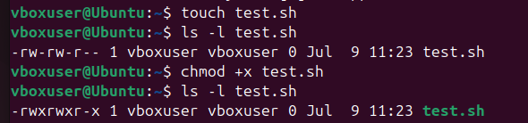
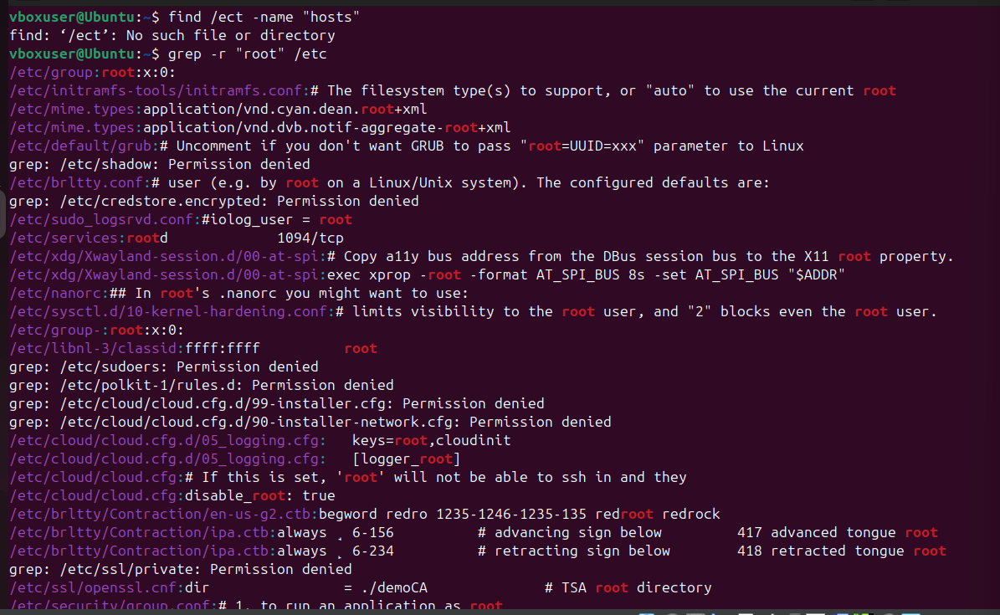
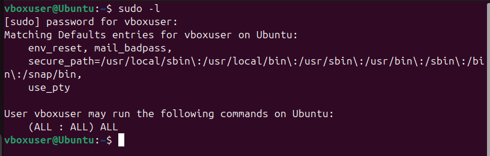
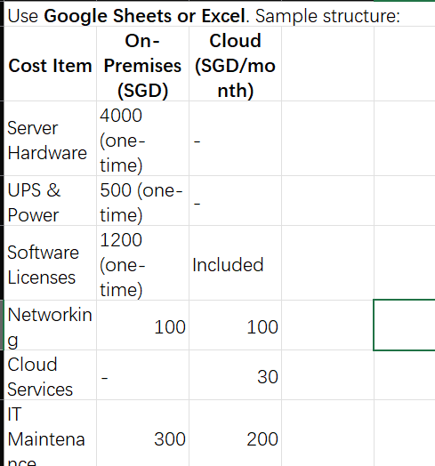
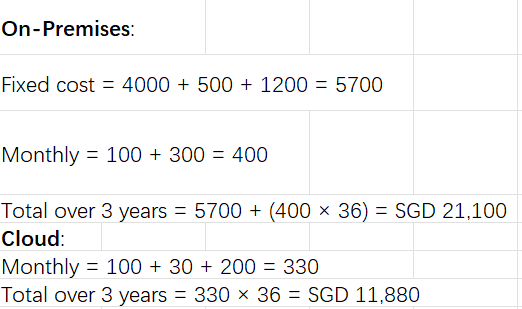
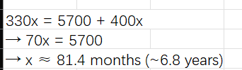
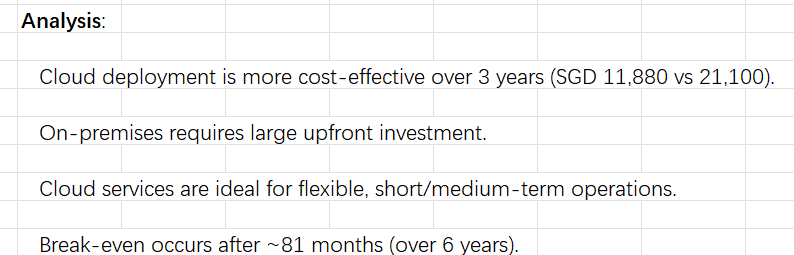

# ISEA Lab Activities - BRG-27

## Day 1 – Morning

### GitHub Repository Setup
- Created GitHub account and repository: `BRG-27-labs`
- Cloned repository to local machine
- Created README.md for documentation

### VirtualBox and Ubuntu Installation
- Installed VirtualBox on host machine
- Downloaded Ubuntu ISO from official website
- Created VM with 4GB RAM and 20GB disk
- Installed Ubuntu successfully

Installation Screenshot:  


### Basic Linux Navigation and Commands
- Practiced using:
  - `pwd`, `ls`, `cd`, `mkdir`, `touch`
- Explored important directories:
  - `/etc`, `/var`, `/home`
- Used `man` to read manual pages (e.g., `man ls`, `man grep`)

## Day 1 – Afternoon

### Linux Service Management
- Listed services with: `systemctl list-units --type=service`
- Started and stopped service: `cron`
- Verified service status using: `systemctl status cron`

Screenshot:  
  
  


### Linux File Permissions
- Viewed file permissions using: `ls -l`
- Modified permissions with: `chmod +x`
- Changed ownership with: `chown`

Screenshot:  


### Searching Filesystem
- Used `find` to locate files
- Used `grep -r` to search file contents

Screenshot:  



- Used `sudo -l` to list allowed sudo commands

Screenshot:  

## Day 2 – Morning: TCO Analysis

### Total Cost of Ownership (TCO)

| Cost Item         | On-Premises (SGD) | Cloud (SGD/month) |
|-------------------|-------------------|-------------------|
| Server Hardware   | 4000              | -                 |
| Power & UPS       | 500               | -                 |
| Software License  | 1200              | Included          |
| Networking        | 100               | 100               |
| Cloud Services    | -                 | 30                |
| IT Maintenance    | 300               | 200               |

3-Year Total Cost:
- On-Premises: SGD 21,100
- Cloud: SGD 11,880

Break-even Point: approximately 81 months

Conclusion:  
Cloud deployment is more cost-effective in the short to medium term due to lower upfront investment and better scalability. On-premises solutions may only become economical after a significantly longer time period.

---

### Supporting Files and Visuals

- [TCO_Comparison.xlsx](./TCO_Comparison.xlsx)
- 
- 
- 
- 
## Day 2 – Afternoon: Cloud Server & Automation Script

### EC2 Instance Configuration (AWS)
- Launched a t2.micro EC2 instance using Ubuntu 22.04 LTS
- Created and downloaded SSH key pair: `isea-key.pem`
- Opened ports for SSH (22), HTTP (80), HTTPS (443)
- Region: ap-southeast-2 (Singapore)

### SSH Access

```bash
chmod 400 isea-key.pem
ssh -i "isea-key.pem" ubuntu@<your-public-ip>

### Bash Script: `daily-log.sh`
```bash
#!/bin/bash
echo "==== Log at $(date) ====" >> /var/log/daily.log
df -h >> /var/log/daily.log
uptime >> /var/log/daily.log
